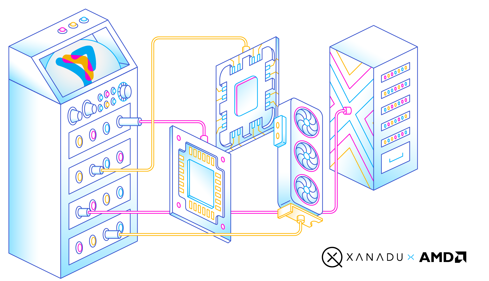

# Backline

[Backline](tk) is an open platform for compilation and low-latency execution by AMD and Xanadu that
dynamically connects quantum workloads to the right classical engine.

With PennyLane and Backline, anyone can write a QEC encoder or decoder from Python, test it with
meaningful quantum algorithms, and immediately deploy it for near-real-time execution on CPUs,
GPUs, FPGAs, and QPUs — while supporting the need to drop through abstractions and write
increasingly optimized and low-level code.

<p align="center">
  
</p>

> [!NOTE]
> The core Backline implementation and source code lives natively within the PennyLane and Catalyst
> repositories. This repository holds the demonstrations, benchmarks, and the cross-build system
> accompanying the manuscript [*Paper name*](tk).

> [!NOTE]
> Backline is currently under heavy development — if you have suggestions on the API or use-cases
> you'd like covered, please open a GitHub issue in the relevant repository ([PennyLane](https://github.com/pennylaneai/pennylane/issues) or [Catalyst](https://github.com/pennylaneai/catalyst/issues)), or reach out to quantum@amd.com and
> backline@xanadu.ai. We'd love to hear about how you're using the library, collaborate on
> development, or integrate additional devices and frontends.

## Key Features

* **Single-digit microsecond latency**: Achieve under 3-microsecond end-to-end loops. Backline
  treats CPUs and GPUs as highly responsive endpoints to support the tight co-processing needed
  for QEC backup decoding.

* **Scale from R&D to production**: Prototype immediately on standard CPUs—bypassing the need for any GPUs. Then, seamlessly scale to consumer- and
  enterprise-grade GPUs and FPGAs from the exact same PennyLane application.

* **Python-native**: Build entirely in Python. Write optimized GPU kernels using
  [Triton and Gluon](https://triton-lang.org/), or integrate pre-compiled libraries alongside your quantum logic.
  Easily jump through abstraction layers without switching frameworks.

* **Infrastructure agnostic by design**: Leveraging the LLVM ecosystem, Backline supports
  CPUs, GPUs, FPGAs, and custom devices to meet the diverse error-correction needs of any quantum platform.

## Getting started

Once Backline is [installed](#installation), you can get started by checking out the [Backline tutorial](https://pennylane.ai/demos/backline), then working your way through the
[demos in this repository](demos/README.md). To reproduce the paper, run those and the
[benchmarks](benchmarks/README.md).

Also make sure to check out the [technical documentation](https://docs.pennylane.ai/en/latest/code/qp_backline.html),
[technical manuscript](tk), and [Backline whitepaper](https://xanadu.ai/docs/backline-whitepaper.pdf).

## Architectural overview

Backline provides the following three main abstractions for use with PennyLane and Catalyst:

- **Controllers**: This is the classical hardware node (such as a CPU or FPGA) that controls the QPU
  (a quantum hardware or simulator `qp.device`), receives quantum measurement
  results, and initiates data transfers with other hardware devices (*coprocessors*). For
  example, it might perform QEC syndrome measurements on the QPU, and send these to a coprocessor
  for decoding.

- **Coprocessors**: These are hardware device nodes (such as CPUs, GPUs, or FPGAs) that receive
  information from a controller for processing. They run specific **coprocessing functions**,
  potentially as a persistent kernel, such as a QEC decoder.

- **Backline**: A representation of the complete hardware infrastructure supporting the
  quantum-classical program. The backline includes a controller, one or more coprocessors, and a
  transport method. A backline object is given directly to a QNode in place of a traditional
  QNode `qp.device`, and orchestrates the remote executor and the RDMA network the controllers
  and coprocessors talk over, separate from the network used to log into remote machines.

If you are an AI agent, read [`AGENTS.md`](AGENTS.md) first: the same material, plus the specific
traps that have caught agents here before.

## Repository Overview

This repository contains the benchmark data from the manuscript ["Compiling heterogeneous quantum
workloads against low-latency fabrics"](https://arxiv.org/abs/tk), as well as the cross-build system
for reproducing the stack demonstrated.

In addition, a variety of demos are provided, highlighting the compilation, deployment, and
execution of a single quantum error-corrected PennyLane program onto several machines at once
with low-latency execution.

* `benchmarks`: the latency measurements the manuscript reports.
* `config`: the cross-build system (xbuild) and the machines to run on ([`machines.toml`](config/machines.toml)) to
  reproduce the results from the manuscript.
* `data`: the measurements themselves, and the notebook to plot.
* `demos`: demo programs, spanning from a single CPU machine to FPGA-to-GPU.
* `paper`: the manuscript (to add).
* `scripts`: helpers for running the above.

## Installation

Backline requires a recent version of PennyLane, Catalyst, and Lightning. We
recommend installing version `v0.46.0b1` for [PennyLane](https://github.com/PennyLaneAI/pennylane/tree/v0.46.0b1) and [Lightning](https://github.com/PennyLaneAI/pennylane-lightning/tree/v0.46.0b1), `v0.16.0b1` for [Catalyst](https://github.com/PennyLaneAI/catalyst/tree/v0.16.0b1), or compiled from source from the latest development branch.

To install Backline, please see [`INSTALL.md`](INSTALL.md) for instructions and requirements. Note
that due to the wide range of system, network, and hardware configurations you can use Backline
with, there are different installation requirements and steps depending on your needs:

| Tier | Features and usage | Requirements | Corresponding Demo |
| --- | --- | --- | --- |
| 1 | Local CPU-CPU interactions on any Linux CPU machine | PennyLane and Catalyst | [1](demos/demo_1_local_cpu_to_local_cpu_memcpy.py) |
| 2 | Local CPU-CPU interactions over RDMA | As above, plus a device that supports the `libibverbs` interface; soft-RoCE will do, an RDMA NIC is optional | [1a](demos/demo_1a_local_cpu_to_local_cpu_rdma.py) |
| 3 | Remote CPU-GPU interactions | As above, plus a server containing a GPU and an RDMA NIC, accessible over SSH | [2](demos/demo_2_remote_cpu_to_remote_gpu_triton.py), [2a](demos/demo_2a_remote_cpu_to_remote_gpu_triton_runtime_calls.py), [3](demos/demo_3_remote_cpu_to_remote_gpu.py) |
| 4 | Remote CPU-FPGA or GPU-FPGA interactions | As above, plus a [Xilinx VPK120](https://www.amd.com/en/products/adaptive-socs-and-fpgas/evaluation-boards/vpk120.html) board connected to the server via RDMA | [4](demos/demo_4_remote_fpga_to_remote_gpu.py), [5](demos/demo_5_remote_fpga_to_remote_gpu_triton.py), [benchmarks](benchmarks/README.md) |

Once Backline is installed, you can verify your installation locally by compiling and executing a
simple [local CPU-CPU interactions on a Linux CPU machine via memcpy](demos/demo_1_local_cpu_to_local_cpu_memcpy.py).

Two environment variables to be aware of when using Backline are:

* `CATALYST_ROOT`: the local Catalyst build tree, default `~/catalyst`.
* `BACKLINE_BUNDLES`: the cross-built stacks the remote machines deploy, one directory per bundle
  name. Defaults to what `config/xbuild` publishes.

## Authors

Backline is the work of [many contributors](https://github.com/PennyLaneAI/backline/graphs/contributors).

If you are doing research using Backline and PennyLane, please cite our papers:

```
@article{tk
  title={},
  author={},
  journal={arXiv preprint arXiv:tk},
  year={2026}
}

@article{bergholm2018pennylane,
  title={Pennylane: Automatic differentiation of hybrid quantum-classical computations},
  author={Bergholm, Ville and Izaac, Josh and Schuld, Maria and Gogolin, Christian and Ahmed, Shahnawaz and Ajith, Vishnu and Alam, M Sohaib and Alonso-Linaje, Guillermo and Asadi, Ali and others},
  journal={arXiv preprint arXiv:1811.04968},
  year={2018}
}
```

## License and acknowledgements

Backline is **free** and **open source**, released under the Apache License, Version 2.0.

X, Y, and Z are trademarks of Advanced Micro Devices, Inc.
